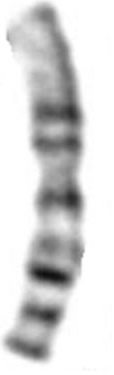

# Image_Classification
Chromosome Analysis or Karyotyping is done to find  
1. Abnormalities such as birth defects/genetic diseases etc.
2. Structural Inconsistencies 

Laboratory process:
1. Take Sample of Your Cells 
2. Sample placed in a laboratory dish that allows the cells to grow.
3. Stain the cells.
4. Observe Under a Microscope (Metaphase)

* Chromosomal suspension is dropped onto slides and stained which results in a kind of banding pattern (what we get is called a metaphase spread)

You should get 46 chromosomes.
Two of these chromosomes are sex chromosomes (determine the sex of the person being tested). Females - XX, Males - XY
The other 44 are called autosomes.

Problem Statement:
Grouping/Rearranging the chromsomes from the metaphase into 23+1 Classes (As Below)

<b>Data Science Initiative:</b>

1. Process Metaphase

              

2. Extract Individual Chromsomes (OPENCV - Python)

3. Orientation & Feature Extraction (Image Processing & Cleaning)

       
  Features Extracted
  
  
  | Length | Area | Banding Profile | Centromere's Location (& Length of both arms )
  | --- | --- | --- | --- |
  | in Pixels | in Pixels |   |  
  
4. Modeling
5. Prediction 
